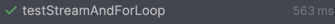

## 프로젝트 투입전 목표

- 동료들도 이용할 수 있는 코드 작성
- 학습한 **design pattern**을 service에 적용
- **test code** 작성
- 선언적 프로그래밍

## 동료들도 이용할 수 있는 코드

프로젝트에서 민감정보 마스킹 처리와 해제에 관련하여 가이드가 내려왔다. 
1. 민감정보는 마스킹 처리를 해야한다. 마스킹 처리는 MaskUtil 내에 있는 메서드를 이용한다.
2. 마스킹 해제 시에 로깅 서비스를 호출해야 한다.

기존에 공통 팀에서 개발해준대로 사용해도 됐지만 뭔가 좀 더 간편한 방법으로 해결하고 싶었다. 그래서 나는 위 두가지 가이드를
목표로 잡아 해결하려고 했다. 우선 해결 방법으로 생각한것은
1번은 JsonSerialize되는 시점에 dto에 @Mask 어노테이션이 붙어 있을때 마스킹 처리를 하도록 고안했다.
2번은 Aop를 사용하여 @MaskApplyLog(uri="", menuId="", sqld="", crerNo="")를 통하여 서비스와 Aop JoinPoint 인자값으로
받을 수 있도록 개발했다. Aop에서 전달받은 인자를 자바 reflection을 이용하여 generic하게 각각의 호출하는 서비스의 reqDto로 
typeCasting하여 mybatis에 queryParam으로 사용할 수 있도록 했다. 위 개발을 진행하면서 reflection과 aop에 대해 알 수 있는
시간이었다.

결론부터 말하면 1번은 아직 과제로 남아있고 2번은 성공하여 공통에 반영된것을 확인했다.

### 아직 해결하지 못한 @Mask 어노테이션 개발
우선 1번 문제를 해결하기 위해  

### 성공하여 공통에 기여한 @MaskApplyLog


위 과정을 진행하면서 내가 학습한 내용을 업무에 적용할 수 있어서 행복했고 동료들도 좋은 피드백을 해주어 기뻣다. 환경이 열악하거나
개발되어 있지 않다면 항상 고민하며 학습해보고 업무에 적용하려고 노력하면 해낼 수 있다고 느낄 수 있는 값진 시간이었다.


## Composite Pattern, Factory Pattern을 판매원장에 녹이기
공부를 해도 실전에 적용해보며 고민하지 않으니 학습이 제대로 됐는지 확인할 방법이 없었다. 실제로 production에 적용할 수 있어야
제대로 학습했다라고 생각했다. 실제로 적절한 서비스가 있어 학습했던 내용을 더듬고 고민하여 원장에 도입해보았다.
간단하게 어떤 구조로 작성했는지 코드를 통해 정리하려고 한다.


## test code 작성
> coverage를 70% 이상 기록해보기

현재 프로젝트는 여러개의 모듈로 구성된 msa 구조로 작성되어 있고 내가 테스트를 하려고 하는 모듈은 서브 모듈로 의존성을 따로 주입하지 않으면,
@SpringBootTest를 진행할 수 없다.
위 문제를 공통 설정이나 config를 변경하지 않고 해결하려고 노력했으나 단위테스트로 코드 검증을 진행하는 방식으로 test code를 작성하는 것으로
마무리됐다. 아직 끝나지 않았지만 해결하기 위해 새로 알게된 내용이나 인사이트에 대해 공유하려고 한다.
1. 의존성 주입에 대한 중요성
2. test fixture
3. mock과 spy의 간단한 차이점


해당 목표를 달성하면서 봉착했던 문제와 습득한 기술에 대하여 간략하게 기록하려고 한다.
- service 레이어 -> mocking 으로 테스트할 수 있다. 
  - 현재 개발에 참여하고 있는 프로젝트에서는 mybatis를 사용하고 있다. 어떻게 하면 mybatis까지 커버하여 테스트할 수 있을지
  - 그래서 우선 mockito를 활용하여 테스트하였다.
- controller 레이어 -> @SpringBootTest, @WebMvcTest 어떤걸 이용해야 하며 controller 레이어에서 사용하고 있는 클래스의 의존성 문제를 어떻게 해결할 것인가.


## Java 8을 최대한 활용하여 개발하기
> Optional, stream을 이용하여 선언적으로 개발해보자

**Optional은 남발하면 성능에 좋지 않다.**

**stream은 보면 볼수록 직관적이다.**
예를 들어 다음과 같은 for문을 stream 한줄로 summary할 수 있으며 사용자 측면에서도 매우 직관적이다. 아래 간단한 예시로 확인해보자.

```java
@Test
void testStreamAndForLoop() {
  List<Integer> numbers = List.of(1, 2, 3, 4, 5, 6, 7, 8, 9, 10);
  List<Integer> resultForForLoop = new ArrayList<>();
  List<Integer> resultForForStream = new ArrayList<>();

  for (Integer number : numbers) {
    if(number > 5){
      resultForForLoop.add(number);
    }
  }
  numbers.stream().filter(number -> number > 5).forEach(number -> resultForForStream.add(number));

  assertEquals(resultForForLoop, resultForForStream);
}
```
테스트가 통과하는 것을 확인할 수 있다. stream에 관련한 성능 이슈도 있지만 가독성 좋은 코드는 뛰어난 강점이 있다고 생각한다.




## History
### 사이트 관리
ENM에서 재무관리 시스템 개발 이후 본사에서 Coding Assistant에 대한 TF로 약 1달의 시간을 보냈다. 정확히 1달이 다 되어 갈 무렵 팀장님이 차주 월요일부터 CGV 프로젝트에 투입될 것이라고 말씀해주셨다. 사이트는 어떤 개발을 진행하게 될지에 대해 
약간 막막함도 있었다. 사이트에서 어떤걸 개발하게 될지와 아직 사용해보지 않은 React에 대한 걱정이 심했던 기억이 있다.

### 판매, 결제, 할인 그리고 적립..
처음 프로젝트에 투입될 당시, 사이트 관리나 React 작업에 대한 걱정이 있었지만 실제로는 전혀 문제가 되지 않았다. 역시 어떤 일이든 직접 부딪혀봐야 진짜로 알 수 있다는 것을 다시 한번 느꼈다.
프로젝트에 투입된 후 PL님이 내가 주로 판매와 결제와 관련된 조회성 화면만 개발할 것이라고 말했다. 처음에는 "어? 그러면 나는 조회성 개빌만 하면 되는 건가? 굳이 도메인에 대한 깊은 이해가 필요할까?"라는 생각이 들었다.
하지만 약 2개월 동안 CGV 프로젝트에서 사용되는 영업, 판매, 결제, 인터페이스 도메인 전반을 파악하며 개발하는 내 모습을 발견할 수 있었다. 실제 업무를 진행하며 도메인을 이해하려고 하기보다, 너무 넓은 비즈니스 로직을 파악하면서 개발을 진행하는 점이 다소 어려웠다.
특히 AS-IS 구조에서 가장 많이 사용되던 예매 테이블과 결제_카드 정산 테이블은 TO-BE 설계에서 제외되었기에, 새로운 설계에 적응하며 개발을 진행하는 데 고민과 노력이 필요했다.

자세하게 담아낼 수는 없고 실제 코드를 아래 정리할 수 없지만 프로젝트를 진행하며 배웠던점과 업무에 적용했던 사례를 글로 남겨보았다.


